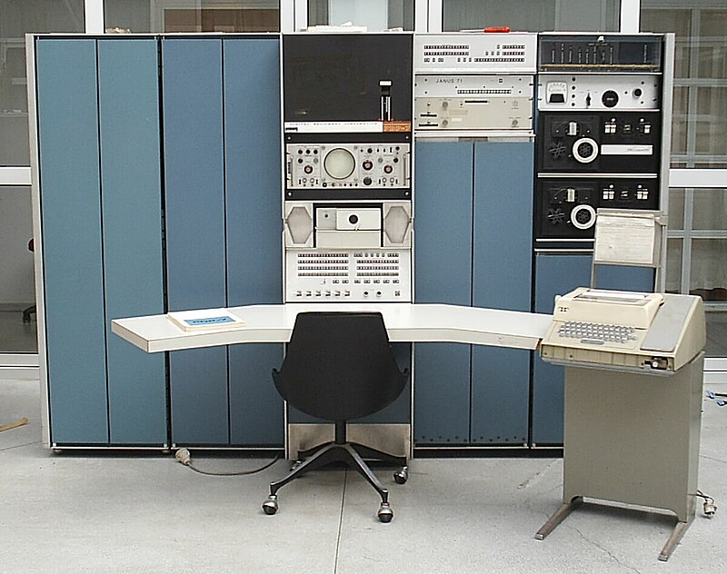

# 1.1 history of C

### Origins

>C is a by-product of the [UNIX operating system], which was developed at [Bell labs] by Ken Thompson, Dennis Ritchie, and others. Thompson single-handedly wrote the original version of UNIX, which ran on the [DEC-PDP-7] computer.

### Standardization

### C-Based Languages

[Bell labs]: https://en.wikipedia.org/wiki/Bell_Labs
[DEC-PDP-7]: https://en.wikipedia.org/wiki/PDP-7
[UNIX operating system]: https://en.wikipedia.org/wiki/Unix